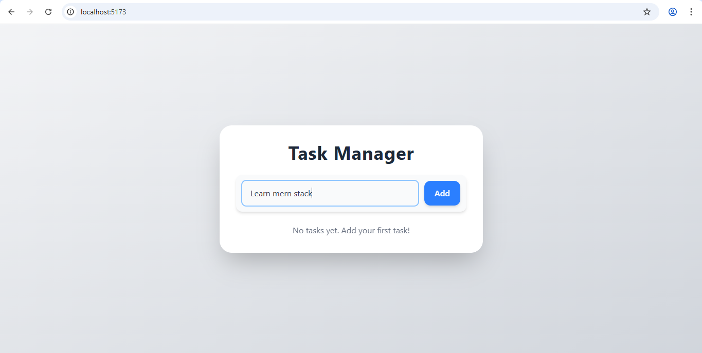
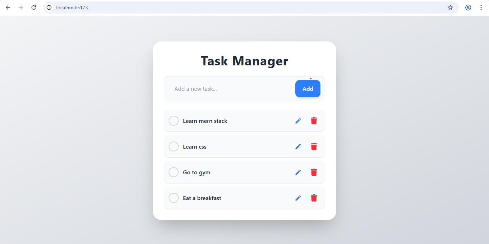
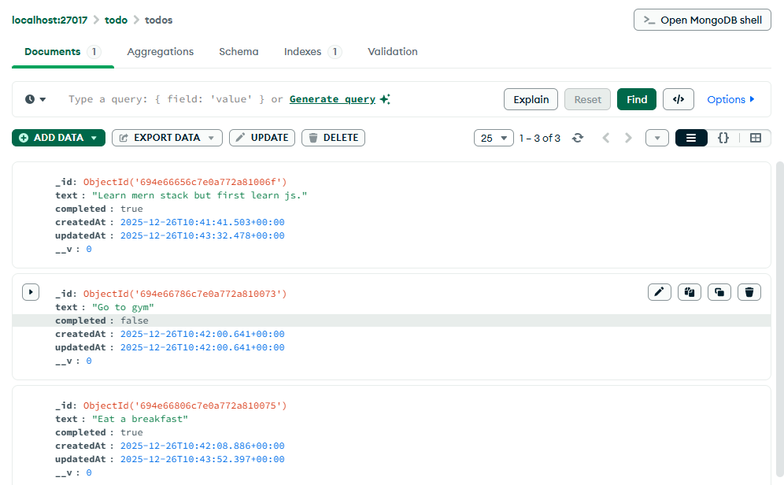

## Description
MERN To-Do App
A full MERN stack To-Do application where you can add, edit, delete, and mark tasks as completed. All tasks are stored in MongoDB, so any changes like adding or deleting tasks are reflected in the database in real-time.

## Features
Add new todos

Edit existing todos

Delete todos

Mark todos as completed

Real-time storage and updates with MongoDB

## Screenshots

## Landing Page

## Adding todo

## Added todo

## Editing a Todo

## Marking a Todo as Completed

## Stored data in MonogoDb

## TechStack

Frontend: React.js

Backend: Node.js, Express.js

Database: MongoDB

Other: Axios for API requests