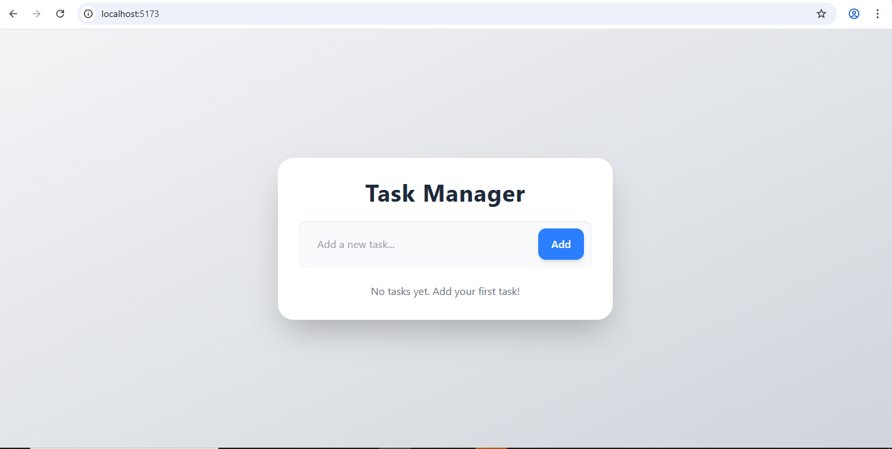
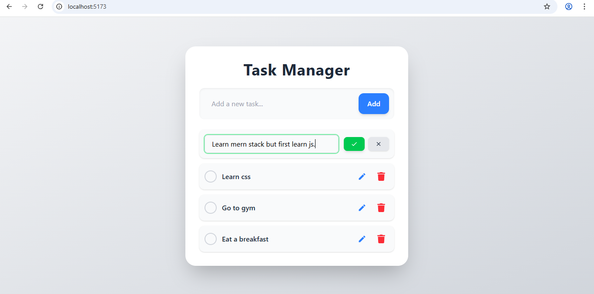

## Description
MERN To-Do App
A full MERN stack To-Do application where you can add, edit, delete, and mark tasks as completed. All tasks are stored in MongoDB, so any changes like adding or deleting tasks are reflected in the database in real-time.

## Screenshots

## Landing Page

## Adding todo
![AddingTask] (screenshots/add_todo.png)

## Added todo
![AddedTodo] (screenshots/added_todo.png)

## Editing a Task

## Marking a Task as Completed

